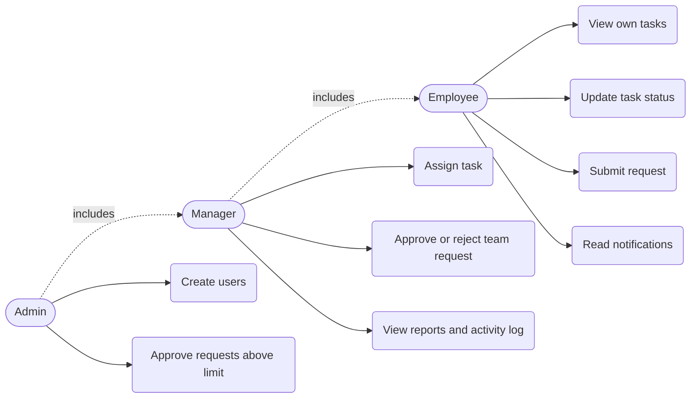
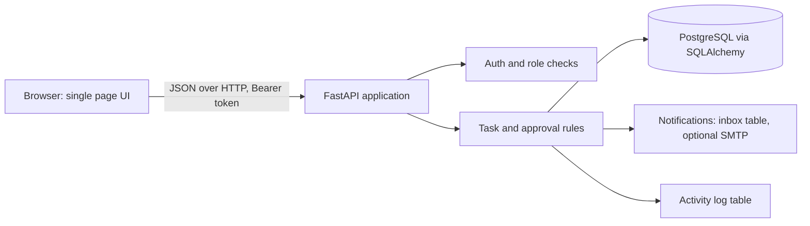
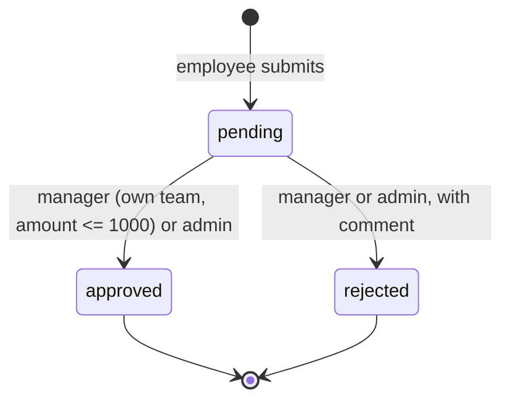

# Diagrams

## Use cases

```mermaid
flowchart LR
    E([Employee]) --> UC1(View own tasks)
    E --> UC2(Update task status)
    E --> UC3(Submit request)
    E --> UC4(Read notifications)
    M([Manager]) --> UC5(Assign task)
    M --> UC6(Approve or reject team request)
    M --> UC7(View reports and activity log)
    M -.includes.-> E
    A([Admin]) --> UC8(Create users)
    A --> UC9(Approve requests above limit)
    A -.includes.-> M
```

## System architecture

```mermaid
flowchart LR
    B[Browser: single page UI] -->|JSON over HTTP, Bearer token| API[FastAPI application]
    API --> AUTH[Auth and role checks]
    API --> LOGIC[Task and approval rules]
    LOGIC --> DB[(PostgreSQL via SQLAlchemy)]
    LOGIC --> N[Notifications: inbox table, optional SMTP]
    LOGIC --> LOG[Activity log table]
```

## Request approval flow

```mermaid
stateDiagram-v2
    [*] --> pending: employee submits
    pending --> approved: manager (own team, amount <= 1000) or admin
    pending --> rejected: manager or admin, with comment
    approved --> [*]
    rejected --> [*]
```
